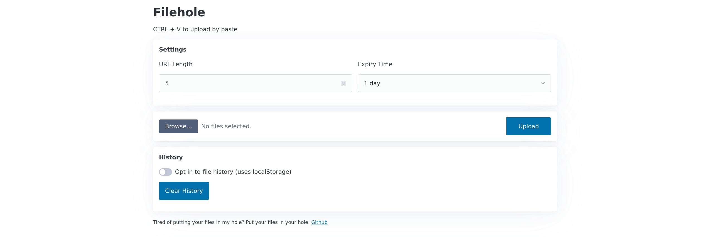

# Filehole

Filehole is a lightweight ephemeral file hosting service written in Go.



## Installation

To install Filehole, use the following command:

```bash
go install github.com/fileholeorg/filehole@latest
```

This will download and install the latest version of Filehole.

## Configuration

Filehole can be configured using environment variables or arguments.

    -bind string
        Address to bind ENV: FH_BIND (default "127.0.0.1:8000")
    -buffer-dir string
        Buffer folder for uploads ENV: FH_STORAGE_DIR (default "./buffer")
    -csp-off
        Disable Content-Security-Policy nonces ENV: FH_CSP_OFF
    -debug
        Enable debug logging for development ENV: FH_DEBUG
    -metadata-path string
        File metadata storage KV store filename ENV: FH_METADATA_FILE (default "./filehole.db")
    -public-url string
        Internet facing URL of the base of the site ENV: FH_PUBLIC_URL (default "https://filehole.org")
    -serve-url string
        Internet facing URL of the base of uploads, only for using a CDN, object storage, etc. ENV: FH_SERVE_URL (default "https://filehole.org")
    -site-name string
        User facing website branding ENV: FH_SITE_NAME (default "Filehole")
    -storage-dir string
        Data storage folder ENV: FH_STORAGE_DIR (default "./data")
    -upload-limit int
        Max allowed size for a HTTP request in bytes ENV: FH_UPLOAD_LIMIT (default 1073741824)
